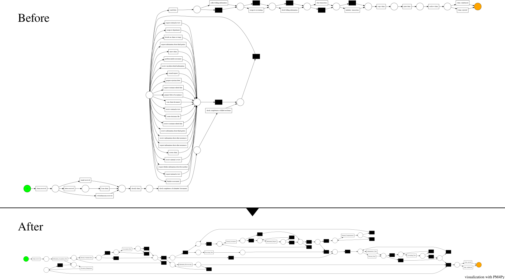

# ODEA-Light

The `ODEA-Light` package provides functionality to quantify, interpret, and configure ontology-based event abstraction for process mining. 

Starting from an [XES Event Log](http://www.xes-standard.org/) and a corresponding ontology, `ODEA-Light` enables to explore and assess different abstraction levels.  After the configuration of a new abstraction level, the initial event log can be enhanced by replacing matching events by their abstract representation.

## Installation

To install `ODEA-Light`, follow the steps below:

```bash
pip install git+https://github.com/bptlab/odea-light.git
```

### SPARQL Endpoint

As the goal of this project is to support semantically meaningful event abstractions, based on domain-specific ontologies, this project uses the free and open source Java framework [Apache Jena Fuseki](https://jena.apache.org/index.html) to set up a local SPARQL endpoint.

1. Install Jena Fuseki according to their [installation guide](https://jena.apache.org/documentation/fuseki2/index.html)
2. Start the server: 
```bash 
./fuseki-server --update --mem /ds
```
3. Upload the [`.owl`](https://github.com/bptlab/odea-light/blob/master/data/ic_ontology.owl) file to the endpoint

### Configuration
This package uses a central `.env` file to organize basic configurations. Please add a new `.env` file in the `odea` directory that provides the following two things:
1. The URL to your Fuseki instance and its endpoint, e.g.:
    `SPARQL_ENDPOINT=SPARQL_ENDPOINT=http://localhost:3030/ds/query`
2. Specify the prefix of the running example: 
   `SPARQL_PREFIX=http://www.semanticweb.org/bpt/ontologies/2021/5/insurance-company#`

## Examples
To showcase the approach the repository contains several demo scripts and one Jupyter Notebook. The later one serves to interactively explore the application of the metrics to define constraints on the abstraction space.

> Please follow the instructions above to install the required package first.

### Scripts

| Metric             | Script                                                        | Description                                                                                              |
| ------------------ | ------------------------------------------------------------- | -------------------------------------------------------------------------------------------------------- |
| **Distance**       | [demo_distance.py](demo/scripts/demo_distance.py)             | demonstrate the computation of the two distance metrics for mapping of low-level and high-level concepts |
| **Granularity**    | [demo_granularity.py](demo/scripts/demo_granularity.py)       | showcases the computation of the granularity of concepts                                                 |
| **Support**        | [demo_support.py](demo/scripts/demo_support.py)               | example to compute the two support metrics for mappings of low-level and high-level concepts             |
| **Expressiveness** | [demo_expressiveness.py](demo/scripts/demo_expressiveness.py) | showcases the computation of the expressiveness of concepts                                              |

### Jupyter Notebook

To experiment with different configurations to define the abstraction space the [Demo Notebook](demo/Constraint%20Demo.ipynb) can be used.

